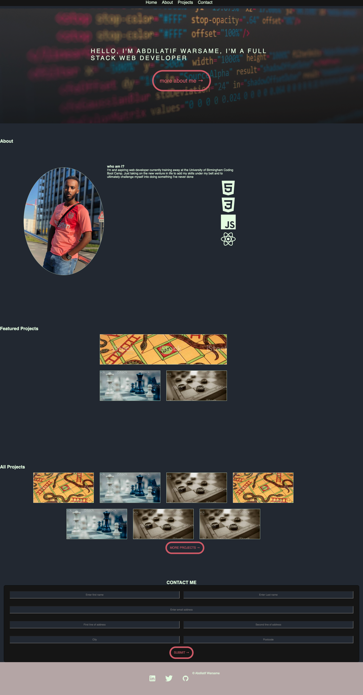
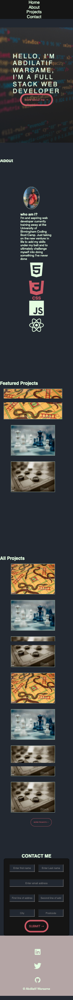

# PORTFOLIO

## DESCRIPTION

portfolio showcasing all my projects
Pieces of the Portfolio:

- Nav links
  - About Me
    - Name
    - Personal statement
    - recent image
    - Skills
  - My Projects
    - Project card with a clickable image to deployed app, a title, brief description (placeholder text for the mean time)
  - Contact Me
  - footer containing icons for github linkedin and twitter.

### WORKDONE

- Nav linked to the different sections (anchor tag href and corresponding id match)
- First project card is larger than the rest
- Project card images with clickable (wrap within anchor tag) and open in new tab
- Responsive layout that adapts to different viewport

## Deployed URL

Github repository: [here](https://github.com/awarsame1996/portfolio)
Live URL: [here](https://awarsame1996.github.io/portfolio/)

## Technologies

- HTML
- CSS
- GitHub Pages
- colorhunt
- devicons
- FontAwesome
- ...more

## Screenshots

### Desktop Viewport

### Mobile Viewport

